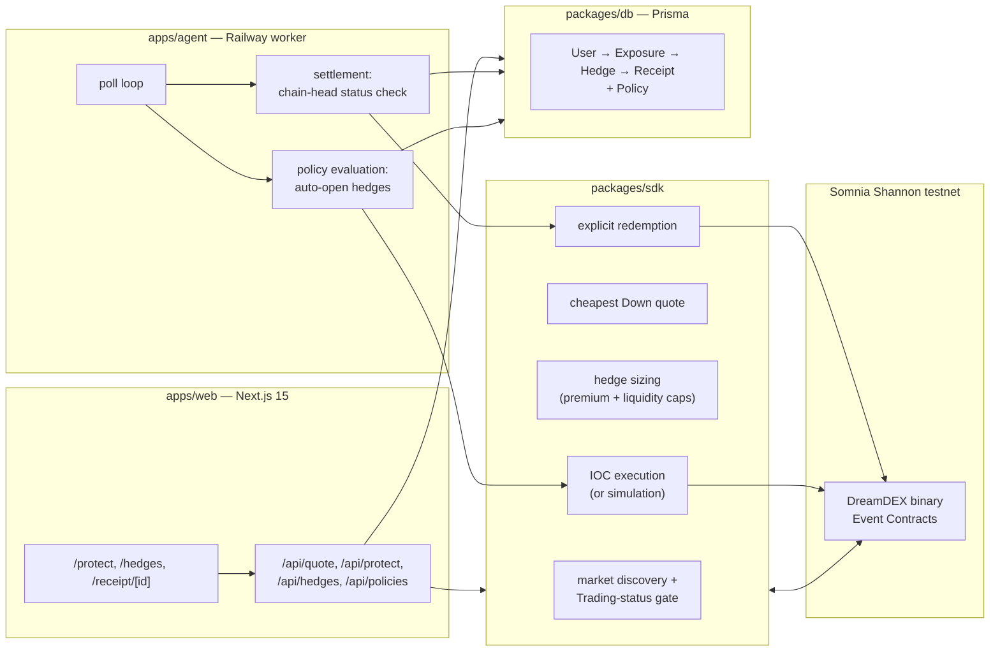

# Watchman

**Watchman is portfolio insurance for DreamDEX Event Contracts that tells you whether the hedge actually offset the loss, not another Up/Down trading UI.**

> A binary Event Contract is not a put. It pays its full face value or nothing, so it will rarely equal your actual loss. Watchman sizes the trade against a real premium budget and live liquidity, then puts the basis difference on the receipt instead of hiding it.

## Best Demo Path

1. Open https://watchman-beta.vercel.app/
2. Go to **Protect**. The default is **BTC / 1 hour** in Demo mode.
3. Observe the live quote and the liquidity constraint.
4. Run the demo protection flow.
5. Open **Hedges**.
6. Open the receipt and inspect the attribution numbers.
7. Compare unhedged P&L vs hedged P&L and see how much loss was actually offset.

**Watchman does not just show that a hedge was bought. It shows what the hedge actually protected.**

## Problem → Solution

Holding BTC or ETH through a volatile window can force a bad tradeoff: sell and give up the position, or hold and absorb the drawdown. Perp hedges add funding and liquidation risk. DreamDEX already lists short-duration binary Event Contracts on Somnia that can hedge downside, but the raw contracts still leave the user to find the right market, size against their exposure, execute before expiry, and work out what happened afterwards.

Watchman is the risk-management layer. Give it an exposure, protection percentage, and premium budget. It finds the cheapest tradeable Down contract, sizes the hedge against real liquidity, executes or simulates the order, tracks settlement, redeems live winning positions, and produces a Hedge Receipt with the economic outcome and loss attribution.

## Why it is different

- **Risk management, not prediction.** Watchman buys Down contracts to offset an existing long. It does not try to predict the next move.
- **Real liquidity.** The requested protection is capped by the contracts actually available and the user's premium budget. A request for $5,000 of protection can honestly show that only $200 is currently obtainable.
- **Attribution.** The receipt separates exposure, premium, actual move, unhedged P&L, hedge payout, hedged P&L, gross loss offset, loss offset percentage, net hedge contribution, and overshoot.
- **End-to-end execution.** Quote, size, execute, settle, redeem, and receipt use one hedge record. The settlement worker checks the market state on-chain before treating a position as settled.
- **Honest demo mode.** Demo mode uses the real quoting and sizing path against live DreamDEX data, records a clearly labelled simulated hedge, and creates a computed demo receipt from the existing effectiveness engine. It never invents a blockchain transaction or claims an on-chain settlement.

## Architecture



The authoritative write gate is `getMarketOnchain(marketId).status === Trading`. Indexed market data drives discovery, then the chain is re-checked immediately before every order and before every redemption. Watchman keys by the bytes32 `marketId` rather than a recycled pool address.

## How to run locally

```bash
pnpm install
cp .env.example .env
pnpm db:generate
pnpm db:migrate
pnpm dev:web
```

Run the settlement/policy agent in a second terminal:

```bash
pnpm dev:agent
```

Verify everything before shipping:

```bash
pnpm typecheck
pnpm test
pnpm build
```

Leave `PRIVATE_KEY` unset to develop in simulation. Quoting and sizing still use live DreamDEX markets; only the final order write is skipped.

## Deployment

The canonical live app is https://watchman-beta.vercel.app/

Full provisioning instructions for Neon, Vercel, and Railway are in **DEPLOY.md**. The web app runs on Vercel and the settlement/policy worker runs continuously on Railway against the same Neon Postgres database.

## Tech stack

- **Frontend:** Next.js 15, React 19, TypeScript, Tailwind CSS v4
- **Backend:** Next.js Route Handlers plus a standalone Node/TypeScript worker
- **Data:** Neon Postgres + Prisma (`User → Exposure → Hedge → Receipt`, plus `Policy`)
- **Chain:** `@somnia-chain/markets-sdk` + viem
- **Network:** Somnia Shannon testnet, chain `50312`; collateral tUSDC
- **Hosting:** Vercel + Railway

## Risk model

For a hedge with exposure `E`, protection fraction `p`, Down price `q`, and `n` contracts:

```text
protected amount = E × p
premium          = n × q
potential payout = n
```

`n` is capped by both the premium budget and currently available Down liquidity.

After a live settlement:

```text
unhedged P&L          = exposure × actual move
hedged P&L            = unhedged P&L + payout − premium
gross loss offset     = min(realised loss, payout)
loss offset %         = gross loss offset / realised loss
net hedge contribution = payout − premium
overshoot             = max(0, payout − realised loss)
```

## Honest limitations

- **Binary contracts are not perfect puts.** A Down Event Contract pays a fixed amount per contract rather than scaling with the size of the underlying loss.
- **Coverage is bounded by the contract window.** A 1-hour contract protects that window. Watchman does not auto-roll a hedge into another market.
- **Liquidity-limited sizing.** If the book cannot fill the requested protection, Watchman fills what it can and reports the shortfall.
- **Demo mode is simulated execution.** Quotes and sizing use live market data. The demo hedge and receipt are explicitly labelled as simulated/computed, with no fabricated transaction hash or on-chain settlement claim.
- **No mainnet support.** Watchman is pinned to Somnia Shannon testnet.
