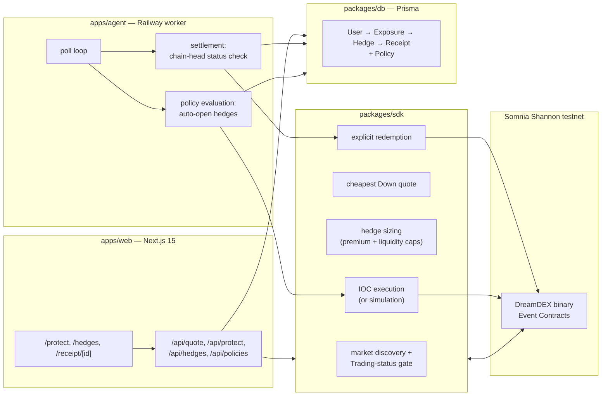

# Watchman

**Watchman is the risk-management layer for DreamDEX Event Contracts. Keep the position, buy the downside event, and see exactly what the hedge actually did.**

> A binary Event Contract is not a put. It pays its full face value or nothing, so it will rarely equal your actual loss. Watchman sizes that trade against a real premium budget and live liquidity, then puts the gap — the basis difference — on the receipt instead of hiding it.

## Problem → Solution

Holding BTC or ETH through a volatile window (a CPI print, an unlock, the next 15 minutes) usually forces a bad tradeoff: sell and eat the tax/opportunity cost, or hold and eat the drawdown — perp hedges add funding costs and liquidation risk, and real options aren't available to most on-chain holders. DreamDEX already lists short-duration binary Event Contracts on Somnia that could hedge this, but they're a raw trading primitive: someone still has to find the right market, size it against their actual exposure, execute before the window closes, and track what happened to their money. **Watchman is that missing layer** — give it an exposure, a protection percentage, and a premium budget, and it finds the cheapest tradeable Down contract, sizes the hedge, executes the order, watches the market resolve, redeems the winning side, and hands back a Hedge Receipt showing exactly what the hedge did to the position's P&L, basis risk stated up front rather than buried in a footnote.

## Why this is different

Most hackathon submissions against an event-contract market either (a) build another trading UI for the raw contracts, or (b) build a generic "AI trading bot" that predicts direction. Watchman does neither:

- **It's not a prediction product.** Watchman never bets on direction — it only ever buys the Down side to offset an existing long, sized to a protection percentage the user chooses. The "alpha" is risk management, not forecasting.
- **It's honest about basis risk.** A binary Event Contract pays a fixed amount, not a variable amount proportional to loss like a real put. Every Hedge Receipt shows unhedged P&L next to hedged P&L and states the efficiency gap explicitly, instead of presenting the hedge as a perfect offset.
- **It closes the loop end to end.** Quote → size → execute → settle → redeem → receipt is one pipeline with one data model (`User → Exposure → Hedge → Receipt`), not a UI bolted onto someone else's order book. The settlement worker resolves against the on-chain market state (`getMarketOnchain(marketId).status`), not a cached indexer row, because pool addresses on DreamDEX are recycled across markets.
- **Judges can run the entire flow with zero setup.** No wallet, no faucet, no funding. Demo mode runs the real quoting and sizing logic against live DreamDEX markets and only skips the final on-chain write, so the numbers are real even when the transaction is simulated.

## Best demo path (4 steps)

1. **Click "Try Demo — $10k BTC, 50%, 15m"** on the landing page. This goes straight to `/protect` pre-filled with a $10,000 BTC exposure, 50% protection, and a 15-minute window in Demo mode — no wallet, no funding.
2. **Review the live quote and click "Protect Position."** The quote panel is pulling a real DreamDEX Down market (current Down price, contracts, premium, potential payout). The amber **"Simulated order"** badge confirms no on-chain transaction will fire.
3. **Open the created hedge** from the confirmation card, or visit `/hedges` to see it being tracked.
4. **Open the Hedge Receipt** once the window resolves and the settlement agent processes it — "What the hedge actually did" states the result in one sentence, followed by exposure, premium, actual move, payout, unhedged vs. hedged P&L, net protection, and efficiency.

Optional extras to show: `/policy` lets you hand Watchman a standing rule the agent evaluates automatically, and switching to Wallet mode with `PRIVATE_KEY` configured flips the badge to **"Live testnet execution"** and places a real IOC order.

## Architecture



The authoritative write gate is `getMarketOnchain(marketId).status === Trading`. Indexed market data drives discovery, then the chain is re-checked immediately before every order and before every redemption — because DreamDEX binary pools are recycled across markets, so a pool address alone is never a safe market identity. Watchman always keys by the bytes32 `marketId`.

## How to run locally

```bash
pnpm install
cp .env.example .env        # fill in DATABASE_URL at minimum
pnpm db:generate
pnpm db:migrate              # applies the baseline Prisma migration
pnpm dev:web                 # http://localhost:3000
```

Run the settlement/policy agent in a second terminal:

```bash
pnpm dev:agent
```

Verify everything before you ship:

```bash
pnpm typecheck    # tsc --noEmit across all workspaces
pnpm test         # sdk hedge-sizing unit tests
pnpm build        # prisma generate + tsc build (db, sdk, agent) + next build (web)
```

Leave `PRIVATE_KEY` unset to develop entirely in simulation — quoting and sizing hit live DreamDEX markets either way, only the final order write is skipped.

## How to deploy

Full click-by-click instructions (Neon database → Vercel → Railway, zero to live in under 10 minutes) live in **[DEPLOY.md](./DEPLOY.md)**.

Short version: `packages/db` and `packages/sdk` ship as raw TypeScript source (no build step), so `apps/web` deploys to Vercel with Root Directory `apps/web` and just runs `pnpm --filter @watchman/web build` (`apps/web/vercel.json` + `next.config.ts`'s `transpilePackages` make Next compile that source in-place — nothing to build first, nothing to get wrong). `apps/agent` deploys to Railway (root-level `railway.json`) as a long-running worker (not a cron job) running `pnpm --filter @watchman/agent start`, which runs the agent directly via `tsx` — no compile step there either. Both services need the same `DATABASE_URL`; `PRIVATE_KEY` is optional on both and controls whether orders are simulated or real. See [.env.example](./.env.example) for the full variable reference.

## Tech stack

- **Frontend:** Next.js 15 (App Router) + React 19 + TypeScript + Tailwind CSS v4
- **Backend:** Next.js Route Handlers (quoting, execution) + a standalone Node/TypeScript worker (settlement, policies)
- **Data:** Neon Postgres + Prisma (`User → Exposure → Hedge → Receipt`, plus `Policy`)
- **Chain integration:** `@somnia-chain/markets-sdk` (DreamDEX market discovery, order book, IOC orders, redemption) + viem
- **Network:** Somnia Shannon testnet, chain `50312`; collateral tUSDC (`0x70a86D8842FB63C4Ad2b7cdddF530eBf1BB25d8E`, 6 decimals)
- **Hosting:** Vercel (web) + Railway (agent)

## Risk model

For a hedge with exposure `E`, protection fraction `p`, Down price `q`, and `n` contracts:

```text
protected amount = E × p
premium          = n × q
potential payout  = n
```

`n` is capped by both the premium budget and currently available Down liquidity — Watchman never sizes past what it can actually fill.

After settlement:

```text
unhedged P&L = exposure × actual move
hedged P&L   = unhedged P&L + payout − premium
net protection = hedged P&L − unhedged P&L
efficiency      = net protection / premium
```

## Honest limitations

- **Binary contracts are not perfect puts.** A Down Event Contract pays a fixed amount per contract regardless of how far the market moved past the strike/event boundary — it does not scale with the size of the move the way a real put's intrinsic value does. Watchman's receipts show this gap directly (`unhedged P&L` vs `hedged P&L`) rather than hiding it behind a single "you were protected" number.
- **Coverage is bounded by the contract's own window.** A 15-minute or 1-hour Down contract only protects against moves inside that window. A move that starts one second after expiry is not covered, and Watchman does not auto-roll a hedge into a new window today.
- **Liquidity-limited sizing.** If the cheapest Down market doesn't have enough resting liquidity to fill the requested protection, Watchman fills what it can and reports the shortfall rather than over-paying across multiple markets.
- **Demo mode numbers are real, execution is not.** Quotes, sizing, and settlement math in Demo mode all run against live DreamDEX data — only the on-chain order/redemption step is skipped. It is not a canned/mocked walkthrough, but it is also not a funded position.
- **No mainnet support.** Every constant in `packages/sdk/src/config.ts` is pinned to Somnia Shannon testnet on purpose.
