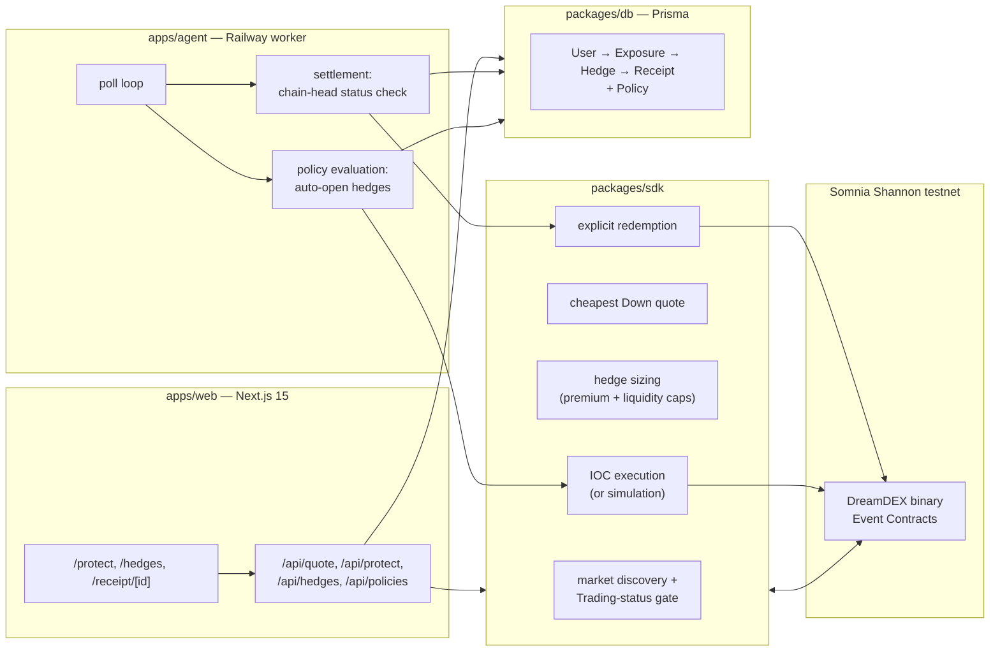

# Watchman

**Turn DreamDEX Event Contracts into short-duration portfolio insurance — no options desk, no liquidation risk, no selling the position.**

## Problem → Solution

Holding BTC or ETH through a volatile window (a CPI print, an unlock, the next 15 minutes) usually means one of two bad choices: sell the position and eat the tax/opportunity cost, or hold it and eat the drawdown. Perpetual futures hedges bring funding costs and liquidation risk. Traditional options aren't available for most retail holders, especially on-chain.

DreamDEX already lists short-duration binary Event Contracts ("will BTC be up or down in the next 15 minutes / hour") on Somnia. Those are a trading primitive, not a product — a trader still has to find the right market, size a position against their actual exposure, execute before the window closes, track settlement, and figure out what actually happened to their money.

**Watchman is that missing layer.** Tell it an exposure, a protection percentage, and a premium budget. It finds the cheapest currently-tradeable Down contract, sizes the hedge, executes an IOC order, watches the market resolve, redeems the winning side, and hands back a Hedge Receipt showing exactly what the hedge did to the position's P&L — in plain numbers, with basis risk stated up front rather than buried in a footnote.

## Why this is different

Most hackathon submissions against an event-contract market either (a) build another trading UI for the raw contracts, or (b) build a generic "AI trading bot" that predicts direction. Watchman does neither:

- **It's not a prediction product.** Watchman never bets on direction — it only ever buys the Down side to offset an existing long, sized to a protection percentage the user chooses. The "alpha" is risk management, not forecasting.
- **It's honest about basis risk.** A binary Event Contract pays a fixed amount, not a variable amount proportional to loss like a real put. Every Hedge Receipt shows unhedged P&L next to hedged P&L and states the efficiency gap explicitly, instead of presenting the hedge as a perfect offset.
- **It closes the loop end to end.** Quote → size → execute → settle → redeem → receipt is one pipeline with one data model (`User → Exposure → Hedge → Receipt`), not a UI bolted onto someone else's order book. The settlement worker resolves against the on-chain market state (`getMarketOnchain(marketId).status`), not a cached indexer row, because pool addresses on DreamDEX are recycled across markets.
- **Judges can run the entire flow with zero setup.** No wallet, no faucet, no funding. Demo mode runs the real quoting and sizing logic against live DreamDEX markets and only skips the final on-chain write, so the numbers are real even when the transaction is simulated.

## Live demo walkthrough

1. Open the landing page and click **"Try Demo — $10k BTC, 50%, 15m"**. This goes straight to `/protect` pre-filled with a $10,000 BTC exposure, 50% protection, and a 15‑minute window in Demo mode — no wallet needed.
2. Watch the **Live quote** panel on the right fill in from a real DreamDEX Down market: current Down price, contracts, premium, and potential payout, refreshed as you adjust the sliders.
3. Note the badge under the mode toggle — **"Simulated order"** (amber) when no `PRIVATE_KEY` is configured, or **"Live testnet execution"** (green) when it is.
4. Click **Protect Position**. Watchman sizes the hedge against your premium budget, and either places a real IOC order (if `PRIVATE_KEY` is set and you're in Wallet mode) or runs the identical pipeline in simulation.
5. Open the created hedge from the confirmation card, or visit **/hedges** to see everything Watchman is tracking.
6. Once the Event Contract's window closes and the market resolves, the settlement agent (`apps/agent`) picks it up automatically, redeems the winning side if applicable, and writes a **Hedge Receipt**.
7. Open the receipt — **"What the hedge actually did"** states in one sentence how far the underlying moved and what the hedge paid out, followed by exposure, premium, actual move, payout, unhedged P&L, hedged P&L, net protection, and efficiency.
8. Optionally visit **/policy** to hand Watchman a standing rule ("keep 50% of my BTC exposure protected for the next 15 minutes, budget $150") — the agent evaluates active policies every poll and opens a new hedge automatically when none is open.

## Architecture



The authoritative write gate is `getMarketOnchain(marketId).status === Trading`. Indexed market data drives discovery, then the chain is re-checked immediately before every order and before every redemption — because DreamDEX binary pools are recycled across markets, so a pool address alone is never a safe market identity. Watchman always keys by the bytes32 `marketId`.

## How to run locally

```bash
pnpm install
cp .env.example .env        # fill in DATABASE_URL at minimum
pnpm db:generate
pnpm db:migrate              # applies the baseline Prisma migration
pnpm dev:web                 # http://localhost:3000
```

Run the settlement/policy agent in a second terminal:

```bash
pnpm dev:agent
```

Verify everything before you ship:

```bash
pnpm typecheck    # tsc --noEmit across all workspaces
pnpm test         # sdk hedge-sizing unit tests
pnpm build        # prisma generate + tsc build (db, sdk, agent) + next build (web)
```

Leave `PRIVATE_KEY` unset to develop entirely in simulation — quoting and sizing hit live DreamDEX markets either way, only the final order write is skipped.

## How to deploy

### Vercel — `apps/web`

1. Import the repo, set the project **Root Directory** to `apps/web`.
2. Build command: `cd ../.. && pnpm --filter @watchman/db generate && pnpm --filter @watchman/sdk build && pnpm --filter @watchman/web build`. Output directory stays the Next.js default (`.next`).
3. Environment variables: `DATABASE_URL` (required), `PRIVATE_KEY` (optional — omit it to run Vercel in demo-only mode).
4. Apply the Prisma migration against your production database once, from any machine with `DATABASE_URL` set: `pnpm db:migrate:deploy`.
5. The in-app `/api/faucet` helper is disabled automatically whenever `NODE_ENV=production`, so it can't be used to drain a shared funded wallet from a public deployment.

### Railway — `apps/agent`

1. Create a service from the repo, root directory can stay the monorepo root.
2. Build command: `pnpm --filter @watchman/db generate && pnpm --filter @watchman/db build && pnpm --filter @watchman/sdk build && pnpm --filter @watchman/agent build`.
3. Start command: `pnpm --filter @watchman/agent start` — this runs the continuous settlement + policy loop (`apps/agent/src/index.ts`), polling every `SETTLEMENT_POLL_MS` (default 10s) forever.
4. Environment variables: `DATABASE_URL` (required, same database as the web app), `PRIVATE_KEY` (required for real redemption and policy-driven execution — without it the agent still settles and writes receipts, using simulated payouts), `SETTLEMENT_POLL_MS` (optional).
5. This must be a long-running worker, not a cron job or serverless function — the loop is the product's settlement guarantee.

With both `DATABASE_URL` and `PRIVATE_KEY` set on both services, Watchman runs its full production path: real IOC orders from `apps/web`, real on-chain redemption from `apps/agent`, against one shared Postgres database.

## Tech stack

- **Frontend:** Next.js 15 (App Router) + React 19 + TypeScript + Tailwind CSS v4
- **Backend:** Next.js Route Handlers (quoting, execution) + a standalone Node/TypeScript worker (settlement, policies)
- **Data:** Neon Postgres + Prisma (`User → Exposure → Hedge → Receipt`, plus `Policy`)
- **Chain integration:** `@somnia-chain/markets-sdk` (DreamDEX market discovery, order book, IOC orders, redemption) + viem
- **Network:** Somnia Shannon testnet, chain `50312`; collateral tUSDC (`0x70a86D8842FB63C4Ad2b7cdddF530eBf1BB25d8E`, 6 decimals)
- **Hosting:** Vercel (web) + Railway (agent)

## Risk model

For a hedge with exposure `E`, protection fraction `p`, Down price `q`, and `n` contracts:

```text
protected amount = E × p
premium          = n × q
potential payout  = n
```

`n` is capped by both the premium budget and currently available Down liquidity — Watchman never sizes past what it can actually fill.

After settlement:

```text
unhedged P&L = exposure × actual move
hedged P&L   = unhedged P&L + payout − premium
net protection = hedged P&L − unhedged P&L
efficiency      = net protection / premium
```

## Honest limitations

- **Binary contracts are not perfect puts.** A Down Event Contract pays a fixed amount per contract regardless of how far the market moved past the strike/event boundary — it does not scale with the size of the move the way a real put's intrinsic value does. Watchman's receipts show this gap directly (`unhedged P&L` vs `hedged P&L`) rather than hiding it behind a single "you were protected" number.
- **Coverage is bounded by the contract's own window.** A 15-minute or 1-hour Down contract only protects against moves inside that window. A move that starts one second after expiry is not covered, and Watchman does not auto-roll a hedge into a new window today.
- **Liquidity-limited sizing.** If the cheapest Down market doesn't have enough resting liquidity to fill the requested protection, Watchman fills what it can and reports the shortfall rather than over-paying across multiple markets.
- **Demo mode numbers are real, execution is not.** Quotes, sizing, and settlement math in Demo mode all run against live DreamDEX data — only the on-chain order/redemption step is skipped. It is not a canned/mocked walkthrough, but it is also not a funded position.
- **No mainnet support.** Every constant in `packages/sdk/src/config.ts` is pinned to Somnia Shannon testnet on purpose.
